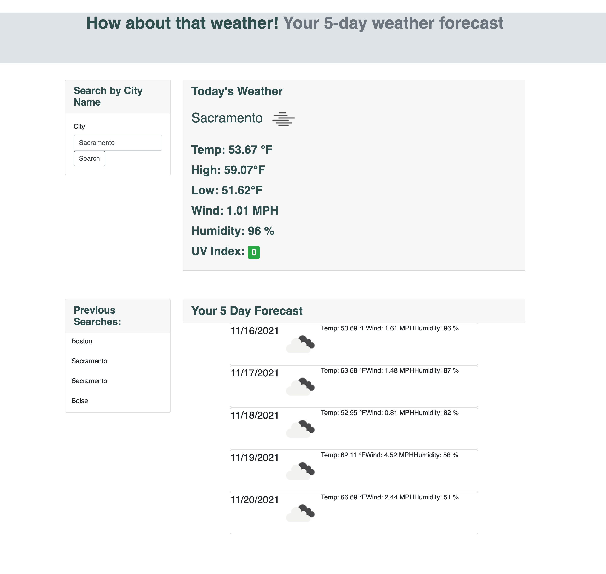

# How about that Weather!
Prepare some small talk with your 5-day weather forecast 

Uses:
* Input international city names for current weather and a 5 day forecast
* Visualize UV index by color - favorable, moderate, or severe
* Access previously searched cities with clickable search history

Weather Stats:
* This dashboard collects information from <a href = "https://openweathermap.org/">OpenWeather's</a> One Call API
* Includes:
    * Temperature (in Farenheit)
    * Visual representation of weather conditions
    * Humidity (%)
    * Wind Speed (in MPH)
    * UV Index

Preview:

Links:
GitHub Repository: https://github.com/magfinn/How-about-that-weather
Deployed URL: https://magfinn.github.io/How-about-that-weather/

